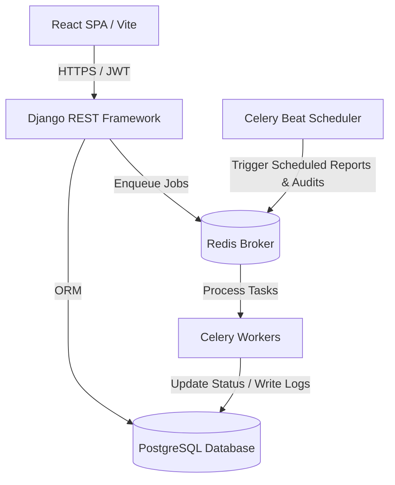

# 🏛️ Ethiopian Federal Property Administration & Asset Management System

[](https://www.djangoproject.com/)
[](https://react.dev/)
[](https://www.docker.com/)
[](LICENSE)

An enterprise-grade, full-stack asset lifecycle and maintenance management system built specifically for **Dire Dawa Management University (DMU)**. This platform strictly enforces the compliance requirements and operational workflows outlined by the **Ethiopian Federal Property Administration Guidelines**.

---

## 📖 Table of Contents
1. [System Architecture](#-system-architecture)
2. [Compliance & Business Rules (BR)](#%EF%B8%8F-compliance--business-rules-br)
3. [Core Features](#-core-features)
4. [Database Schema & Models](#-database-schema--models)
5. [Project Structure](#-project-structure)
6. [Tech Stack](#-tech-stack)
7. [Installation & Setup](#-installation--setup)
8. [Role-Based Access Control (RBAC)](#-role-based-access-control-rbac)

---

## 🏗️ System Architecture

The application is structured as a decoupled web platform with a Django REST API serving a React single-page application (SPA), accompanied by background workers for scheduled jobs and automated compliance auditing:



---

## 🛡️ Compliance & Business Rules (BR)

This system implements rigorous business rules matching the Ethiopian federal standards for public university asset management:

### 📦 Asset Management Rules
*   **BR-AM-01 (High-Value Asset Auditing):** Assets purchased for over **10,000 ETB** are flagged as `is_high_value`. They must be fully registered and audited within **7 days** of purchase, or they are marked as `registration_overdue`.
*   **BR-AM-03 (Controlled Asset Disposal):** Assets scheduled for disposal must follow a rigorous authorization process (`PENDING_MANAGER` ➔ `APPROVED` ➔ `COMPLETED`). In compliance with Ethiopian public record laws, disposed asset records are locked under a **10-year data retention schedule** before final pruning.
*   **BR-AM-04 (Annual Physical Verification):** The system enforces annual audits. Assets calculate their `next_verification_date` (1 year from last verification). Overdue audits automatically trigger alerts and change `verification_status` to `PENDING` or `DISCREPANCY`.
*   **BR-AM-05 (Transfer Validation):** Assets marked as `UNDER_MAINTENANCE` are locked and cannot be transferred between rooms or departments until the work order is completed and signed off.
*   **BR-AM-06 (Sequential Identifier Format):** Automatically generates standard federal asset IDs using the prefix format: `DMU-[CAMPUS_CODE]-[ASSET_TYPE]-[SEQUENTIAL_NUMBER]` (e.g., `DMU-MAIN-EQP-00042`).

### 🔧 Maintenance & SLA Rules
*   **BR-MM-01 (Emergency SLA Tracking):** High-priority emergencies require a **2-hour response window** and a **24-hour resolution window**. Success/failure metrics are permanently written to `SLATracking`.
*   **BR-MM-02 (Financial Approval Thresholds):** Any work order with estimated costs (materials + labor) exceeding **50,000 ETB** is automatically locked and requires explicit approval from a Finance Officer before work can begin.
*   **BR-MM-03 (Critical Equipment Caps):** Maintenance on core infrastructure or critical assets cannot be delayed or waiting for parts for more than **7 days**.
*   **BR-MM-04 (Automated Escalation Engine):** If an asset experiences **3 or more similar issues within a 30-day window**, the request is automatically flagged as recurring, auto-escalated, and sent directly to the Department Head.
*   **BR-MM-05 (External Contractor Compliance):** External contractors must have validated credentials. Work cannot be closed unless a valid contractor license is active and the contractor is verified as a registered vendor.
*   **BR-MM-06 (Dual Sign-Off):** Completed maintenance tasks require verification from both the **Maintenance Supervisor** and the **Original Staff Requester** before they are archived.
*   **BR-OW-01 (After-Hours Request Handling):** Non-emergency requests submitted after-hours (**6:00 PM to 8:00 AM**) are automatically flagged and scheduled for the next calendar day.
*   **BR-DM-02 (Maintenance Retention Compliance):** Detailed maintenance logs, labor records, and material costs are kept for a **7-year period** before archiving.

---

## ✨ Core Features

*   **🔍 QR Code Generation & Scanning:** Instant QR code generation for every registered asset. The React frontend supports in-browser camera scanning (`html5-qrcode`) for quick audits and transfers.
*   **📊 Dynamic Reporting Suite:** Supports exports to **PDF** (via `jspdf` and `jspdf-autotable`) and **Excel / CSV** (via `xlsx`) for asset statuses, utilization rates, and preventive maintenance compliance.
*   **⏱️ Scheduled Reports:** Celery-based reporting engine that can generate periodic emails and PDFs (weekly/monthly) with full pause/resume cycles.
*   **💼 Budget & Expense Tracking:** Track department and campus budget allocations, spent amounts, and pending maintenance transactions.
*   **📜 Immutable Asset Audit Trail:** Records all event checkouts, returns, location transfers, and condition adjustments in an immutable event log.

---

## 🗄️ Database Schema & Models

### 🗺️ Location & Infrastructure
| Model | Description | Key Attributes |
| :--- | :--- | :--- |
| **`Campus`** | University campuses | `code` (Unique), `name`, `address` |
| **`Building`** | Buildings within a specific campus | `campus` (FK), `code`, `name`, `floors_count` |
| **`Floor`** | Floors within a building | `building` (FK), `number`, `name` |
| **`Room`** | Specific rooms, offices, or labs | `floor` (FK), `number`, `name`, `room_type` |

### 📦 Asset & Lifecycle Management
| Model | Description | Key Attributes |
| :--- | :--- | :--- |
| **`Asset`** | Core asset record | `asset_id` (Formatted), `name`, `status`, `purchase_cost`, `is_high_value`, `qr_code` |
| **`AssetTransfer`** | Audited location changes | `asset` (FK), `from_room`, `to_room`, `approval_status`, `transferred_by` |
| **`AssetWarranty`** | Warranty records | `asset` (OneToOne), `provider`, `end_date`, `contact_phone` |
| **`AssetInsurance`** | Insurance policy data | `asset` (FK), `policy_number`, `provider`, `premium_amount`, `renewal_date` |
| **`AssetCheckout`** | Temporary checkouts to staff | `asset` (FK), `checked_out_to`, `expected_return_date`, `is_returned` |
| **`CheckoutExtensionRequest`**| Extension requests for checkouts | `checkout` (FK), `requested_return_date`, `status` (Pending/Approved) |
| **`AssetDisposal`** | Condemning and scrap tracking | `asset` (FK), `disposal_method`, `status`, `retention_date` (10 Years) |
| **`AssetEvent`** | Immutable lifecycle log | `asset` (FK), `event_type` (Enum), `event_data` (JSON), `actor` |

### 🔧 Maintenance & SLA
| Model | Description | Key Attributes |
| :--- | :--- | :--- |
| **`MaintenanceRequest`** | Fault reports and maintenance requests | `request_id`, `asset`, `priority`, `status`, `category`, `response_deadline` |
| **`WorkOrder`** | Maintenance execution order | `request` (OneToOne), `assigned_to`, `cost_labor`, `cost_materials`, `fully_approved` |
| **`PreventiveMaintenance`**| Calendar scheduled service | `asset` (FK), `interval_days`, `next_due_date`, `is_active` |
| **`SLATracking`** | SLA success and duration logger | `request` (OneToOne), `response_met`, `resolution_met`, `escalated` |

### 💰 Budgets & Finances
| Model | Description | Key Attributes |
| :--- | :--- | :--- |
| **`Budget`** | Annual budget allocation | `name`, `fiscal_year`, `total_amount`, `spent_amount`, `campus` |
| **`BudgetTransaction`** | Maintenance or acquisition expenses | `budget` (FK), `transaction_type`, `amount`, `reference_number` |

---

## 📁 Project Structure

```
proo1/
├── backend/                  # Django REST API (Python)
│   ├── apps/
│   │   ├── assets/           # Asset profiles, transfers, checkouts, warranties, QR services
│   │   ├── maintenance/      # Fault requests, work orders, preventive tasks, SLA logs, inventory
│   │   ├── reports/          # Report engines, pdf builders, exports
│   │   ├── users/            # Custom User model, registration, user-profiles
│   │   └── core/             # Audit logs, shared Base models, core middlewares
│   ├── config/               # Django root settings, urls, celery configurations
│   ├── manage.py
│   ├── Dockerfile
│   └── requirements.txt
│
├── frontend/                 # React SPA (Vite + JavaScript)
│   ├── src/
│   │   ├── features/         # Features split by domain (auth, assets, maintenance, reports)
│   │   ├── layouts/          # Responsive navigation & layouts (Sidebar, Header)
│   │   ├── pages/            # View portals (Landing page, Multi-role Login portals)
│   │   ├── services/         # API clients (Axios interceptors, endpoints)
│   │   ├── store/            # Redux store & global states
│   │   └── App.jsx           # Routing & application root
│   ├── package.json
│   └── tailwind.config.js
│
└── docker-compose.yml        # Orchestration (DB, Cache, Workers, API)
```

---

## ⚡ Tech Stack

*   **Backend:** Python 3.10+, Django 4.2+, Django REST Framework, Simple JWT.
*   **Frontend:** React 18, Vite, Material UI (MUI) 5, Tailwind CSS 3, Framer Motion, Redux Toolkit.
*   **Cache & Message Broker:** Redis 7.
*   **Database:** PostgreSQL 14 (SQLite fallback supported for local dev).
*   **Background Tasks:** Celery 5.x & Celery Beat.
*   **Orchestration:** Docker & Docker Compose.

---

## 🚀 Installation & Setup

### Option A: Setup using Docker Compose (Recommended)
Make sure you have [Docker](https://www.docker.com/) installed, then run:

```bash
# 1. Build and launch all services (Database, Redis, Celery, API)
docker-compose up --build -d

# 2. Run database migrations
docker-compose exec backend python manage.py migrate

# 3. Create an administrator account
docker-compose exec backend python manage.py createsuperuser

# 4. Seed system setup data (Campuses, Buildings, Rooms, and mock Assets)
docker-compose exec backend python manage.py shell -c "from apps.assets.management.commands import seed_data; ..." 
```
The API backend will be accessible at `http://localhost:8000/`.

---

### Option B: Manual Local Development Setup

#### 1. Pre-requisites
*   Python 3.10+
*   Node.js 18+
*   PostgreSQL running locally (or fallback to SQLite)

#### 2. Backend Setup
```bash
cd backend

# Create and activate virtual environment
python -m venv venv
source venv/bin/activate  # On Windows: venv\Scripts\activate

# Install dependencies
pip install -r requirements.txt

# Configure environment variables
cp .env.example .env  # Adjust database strings and secrets

# Run migrations and seed DB
python manage.py migrate
python manage.py createsuperuser

# Start development server
python manage.py runserver
```

#### 3. Start Background Workers (for SLA & Reports)
In a separate terminal (with virtualenv active):
```bash
# Start Celery worker
celery -A config worker --loglevel=info

# Start Celery beat scheduler
celery -A config beat --loglevel=info
```

#### 4. Frontend Setup
```bash
cd frontend

# Install dependencies
npm install

# Start Vite dev server
npm run dev
```
The client app will launch at `http://localhost:5173/`.

---

## 👥 Role-Based Access Control (RBAC)

The system supports strict security controls based on professional university roles:

*   **👑 Super Admin:** Global control over campuses, configuration, user account creations, and database purges.
*   **🏢 Property Manager:** Authorized to register assets, approve room-to-room transfers, trigger disposals, and generate regulatory reports.
*   **🔧 Maintenance Supervisor:** Assigns work orders, triggers preventive maintenance plans, and manages technical reassignments.
*   **🛠️ Technician:** Claims assigned work orders, updates completion status, notes materials and labor details, and logs resolution.
*   **👥 Staff / Requester:** Can check out allowed general assets, request extensions, and submit/sign-off on maintenance requests.

---
*Created for Dire Dawa Management University (DMU) — 2026 graduation project.*
